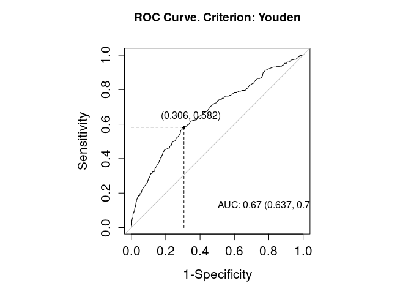

Task3
================

# — Task 3 —

### Visualize PSA and Metastasis

### Task: Create a boxplot comparing PSA values between patients with and without metastasis.

- This will help visually assess the difference in PSA levels across the
  two groups and verify whether PSA is a good discriminator.

``` r
# Boxplot of PSA values grouped by metastasis status
#install.packages("OptimalCutpoints")

library(ggplot2)

ggplot(merged_all, aes(x = factor(metastasis), y = psa, fill = factor(metastasis))) +
  geom_boxplot() +
  labs(
    title = "PSA Levels by Metastasis Status",
    x = "Metastasis (0 = No, 1 = Yes)",
    y = "PSA (ng/ml)"
  ) +
  scale_fill_manual(values = c("#56B4E9", "#D55E00"), labels = c("No", "Yes")) +
  theme_minimal()
```

<!-- -->

``` r
library(OptimalCutpoints)

# Run Youden index method
cutpoint.Youden <- optimal.cutpoints(
  X = "psa", 
  status = "metastasis", 
  tag.healthy = 0, 
  methods = "Youden", 
  data = merged_all, 
  ci.fit = TRUE, 
  trace = FALSE
)
```

    ## Warning: Sensitivity CI: "Exact" method may not be valid for some values (see Help Manual).

    ## Warning: Specificity CI: "Exact" method may not be valid for some values (see Help Manual).

    ## Warning: Positive Predictive Value CI: "Exact" method may not be valid for some values (see Help Manual).

    ## Warning: Negative Predictive Value CI: "Exact" method may not be valid for some values (see Help Manual).

``` r
# Summary of the result
summary(cutpoint.Youden)
```

    ## 
    ## Call:
    ## optimal.cutpoints.default(X = "psa", status = "metastasis", tag.healthy = 0, 
    ##     methods = "Youden", data = merged_all, ci.fit = TRUE, trace = FALSE)
    ## 
    ## Area under the ROC curve (AUC):  0.67 (0.637, 0.702) 
    ## 
    ## CRITERION: Youden
    ## Number of optimal cutoffs: 1
    ## 
    ##                      Estimate 95% CI lower limit 95% CI upper limit
    ## cutoff             23.0000000                  -                  -
    ## Se                  0.5819477          0.5332059          0.6295297
    ## Sp                  0.6937669          0.6591080          0.7268684
    ## PPV                 0.5201699          0.4805736          0.5695826
    ## NPV                 0.7441860          0.7047636          0.7736160
    ## DLR.Positive        1.9003426          1.6596096          2.1759950
    ## DLR.Negative        0.6025831          0.5331236          0.6810924
    ## FP                226.0000000                  -                  -
    ## FN                176.0000000                  -                  -
    ## Optimal criterion   0.2757147                  -                  -

``` r
saveRDS(cutpoint.Youden, file = "../data/cutpoint.Youden.rds")

# Optional plot
plot(cutpoint.Youden)
```

<!-- -->

    ## Press return for next page....

<!-- -->

Using the Youden index method, we found the optimal PSA cutoff point to
be around X ng/ml. This threshold maximizes the trade-off between
sensitivity and specificity. However, while the Youden index is commonly
used and easy to interpret, it may not always be the most clinically
appropriate if false positives or false negatives have asymmetric costs.

As an alternative, we explored the MaxEfficiency method (or another of
your choice), which produced a different cutoff. The best method may
depend on clinical priorities, such as minimizing missed metastasis
cases versus avoiding unnecessary testing.
