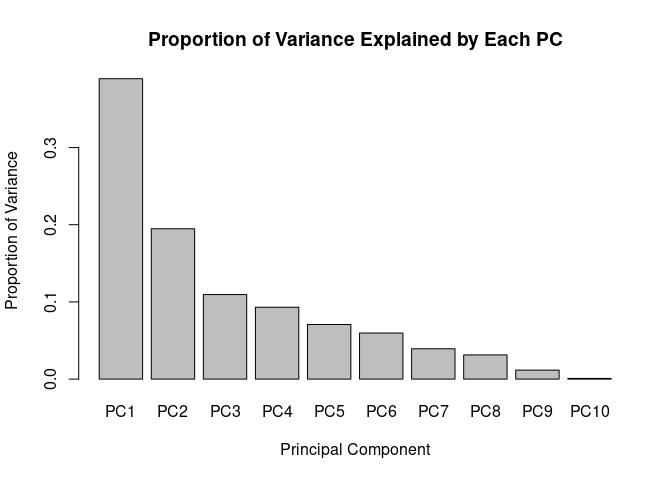

Task4
================

``` r
# Install if needed. OUTCOMMENT install.package("pROC"), ITS BEIN SUSSY
#install.packages("pROC")

# Load package
library(dplyr)
```

    ## 
    ## Attaching package: 'dplyr'

    ## The following objects are masked from 'package:stats':
    ## 
    ##     filter, lag

    ## The following objects are masked from 'package:base':
    ## 
    ##     intersect, setdiff, setequal, union

``` r
library(pROC)
```

    ## Type 'citation("pROC")' for a citation.

    ## 
    ## Attaching package: 'pROC'

    ## The following objects are masked from 'package:stats':
    ## 
    ##     cov, smooth, var

``` r
# Select biomarker columns
biomarkers <- merged_all %>%
  select(monocyte:coag_factor)

# Perform PCA
pca.model <- prcomp(biomarkers, center = TRUE, scale. = TRUE)

# Summary of PCA (explained variance)
summary(pca.model)
```

    ## Importance of components:
    ##                           PC1    PC2    PC3     PC4     PC5     PC6    PC7
    ## Standard deviation     1.9728 1.3954 1.0465 0.96482 0.84073 0.77238 0.6269
    ## Proportion of Variance 0.3892 0.1947 0.1095 0.09309 0.07068 0.05966 0.0393
    ## Cumulative Proportion  0.3892 0.5839 0.6934 0.78652 0.85720 0.91686 0.9562
    ##                            PC8     PC9    PC10
    ## Standard deviation     0.55970 0.34128 0.09324
    ## Proportion of Variance 0.03133 0.01165 0.00087
    ## Cumulative Proportion  0.98748 0.99913 1.00000

``` r
# Variance explained
explained_var <- pca.model$sdev^2 / sum(pca.model$sdev^2)

barplot(explained_var,
        main = "Proportion of Variance Explained by Each PC",
        xlab = "Principal Component",
        ylab = "Proportion of Variance",
        names.arg = paste0("PC", 1:length(explained_var)))
```

<!-- -->

``` r
eigenvalues <- pca.model$sdev^2
print(eigenvalues)
```

    ##  [1] 3.89183769 1.94727392 1.09521840 0.93087075 0.70683199 0.59656704
    ##  [7] 0.39296368 0.31326908 0.11647411 0.00869333

``` r
# Loadings (how each original variable contributes to each PC)
print(round(pca.model$rotation[, 1:4], 2))  # Adjust number of PCs as needed
```

    ##               PC1   PC2   PC3   PC4
    ## monocyte     0.38 -0.11  0.14  0.17
    ## urea        -0.29  0.04  0.48  0.52
    ## lymphocyte   0.35 -0.17 -0.05  0.03
    ## thrombocyte  0.41 -0.24  0.23  0.24
    ## erythrocyte  0.41 -0.20  0.26  0.21
    ## albumin     -0.13 -0.59 -0.25 -0.11
    ## creatinine  -0.32 -0.53  0.05 -0.04
    ## globulin    -0.13 -0.44  0.34 -0.26
    ## psa         -0.09 -0.17 -0.60  0.66
    ## coag_factor -0.41  0.06  0.30  0.29

``` r
components <- as.data.frame(pca.model$x[, 1:3])  # PCs 1–3
colnames(components) <- c("PC1", "PC2", "PC3")

# Merge with main dataset
merged_all_pca <- bind_cols(merged_all, components)

save.image(file = '../.RData')
```
