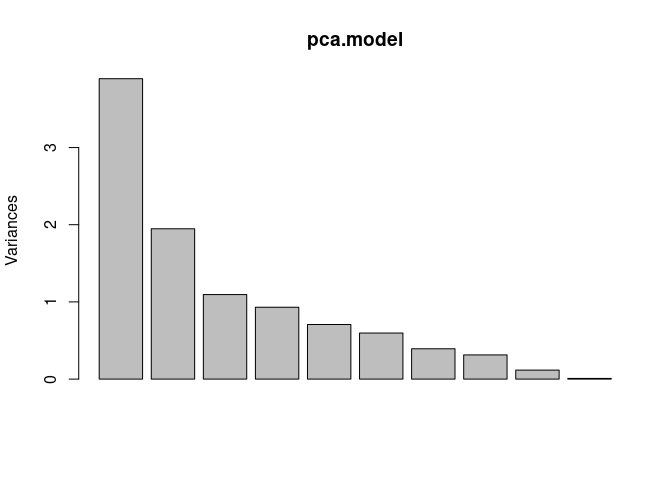

Task4
================

# — Task 4 —

### ROC stuff

``` r
# Install if needed
#install.packages("pROC")

# Load package
library(pROC)
```

    ## Type 'citation("pROC")' for a citation.

    ## 
    ## Attaching package: 'pROC'

    ## The following objects are masked from 'package:stats':
    ## 
    ##     cov, smooth, var

``` r
# Compute ROC curve
roc_obj <- roc(response = merged_all$metastasis, predictor = merged_all$psa)
```

    ## Setting levels: control = 0, case = 1

    ## Setting direction: controls < cases

``` r
# Plot ROC curve
plot(roc_obj, col = "#1f78b4", main = "ROC Curve for PSA vs. Metastasis", print.auc = TRUE)

# Get AUC
auc(roc_obj)
```

    ## Area under the curve: 0.6696

``` r
# Extract numeric cutoff from the result
youden_cutoff <- cutpoint.Youden$Youden$Global$optimal.cutoff[[1]]

# Confirm it's numeric
print(youden_cutoff)  # Should be 23
```

    ## [1] 23

``` r
# Compute coordinates at that cutoff
coords <- coords(roc_obj, x = youden_cutoff, input = "threshold", ret = c("specificity", "sensitivity"))

# Add point to ROC plot
points(1 - coords["specificity"], coords["sensitivity"], col = "red", pch = 19)

text(1 - coords["specificity"], coords["sensitivity"], labels = paste0("Cutoff = ", youden_cutoff), pos = 3)
```

<!-- -->
