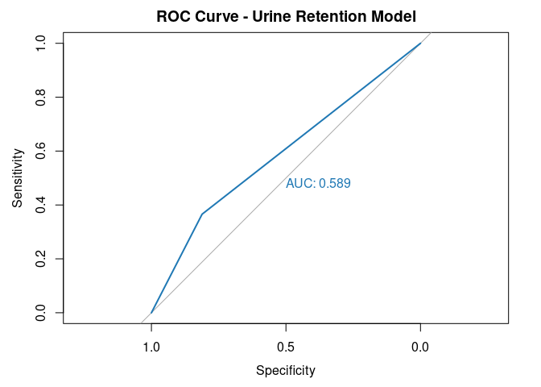

Task1
================

``` r
# --- Task 1: Simple Logistic Regression ---
merged_all = readRDS('../../module1/data/merged_all.rds')
merged_all_new <- merged_all


# Build the logistic regression model
model_simple <- glm(metastasis ~ Urin_ret, data = merged_all, family = "binomial")

# Summarize the model
summary(model_simple)
```

    ## 
    ## Call:
    ## glm(formula = metastasis ~ Urin_ret, family = "binomial", data = merged_all)
    ## 
    ## Coefficients:
    ##             Estimate Std. Error z value Pr(>|z|)    
    ## (Intercept) -0.80801    0.07359 -10.981  < 2e-16 ***
    ## Urin_ret     0.91049    0.13821   6.588 4.47e-11 ***
    ## ---
    ## Signif. codes:  0 '***' 0.001 '**' 0.01 '*' 0.05 '.' 0.1 ' ' 1
    ## 
    ## (Dispersion parameter for binomial family taken to be 1)
    ## 
    ##     Null deviance: 1518.9  on 1158  degrees of freedom
    ## Residual deviance: 1475.4  on 1157  degrees of freedom
    ## AIC: 1479.4
    ## 
    ## Number of Fisher Scoring iterations: 4

``` r
# Interpret coefficients
exp(coef(model_simple))  # Exponentiate to get odds ratios
```

    ## (Intercept)    Urin_ret 
    ##   0.4457429   2.4855441

``` r
# Predict probabilities
merged_all$predicted_prob <- predict(model_simple, type = "response")

# Classify based on threshold 0.5
merged_all$predicted_class <- ifelse(merged_all$predicted_prob >= 0.5, 1, 0)

# Confusion matrix
table(Predicted = merged_all$predicted_class, Actual = merged_all$metastasis)
```

    ##          Actual
    ## Predicted   0   1
    ##         0 599 267
    ##         1 139 154

``` r
# Accuracy
accuracy <- mean(merged_all$predicted_class == merged_all$metastasis)

# Sensitivity and Specificity
TP <- sum(merged_all$predicted_class == 1 & merged_all$metastasis == 1)
TN <- sum(merged_all$predicted_class == 0 & merged_all$metastasis == 0)
FP <- sum(merged_all$predicted_class == 1 & merged_all$metastasis == 0)
FN <- sum(merged_all$predicted_class == 0 & merged_all$metastasis == 1)

sensitivity <- TP / (TP + FN)
specificity <- TN / (TN + FP)

# Print results
cat("Accuracy:", round(accuracy, 3), "\n")
```

    ## Accuracy: 0.65

``` r
cat("Sensitivity:", round(sensitivity, 3), "\n")
```

    ## Sensitivity: 0.366

``` r
cat("Specificity:", round(specificity, 3), "\n")
```

    ## Specificity: 0.812

``` r
library(pROC)
```

    ## Type 'citation("pROC")' for a citation.

    ## 
    ## Attaching package: 'pROC'

    ## The following objects are masked from 'package:stats':
    ## 
    ##     cov, smooth, var

``` r
# ROC
roc_simple <- roc(merged_all$metastasis, merged_all$predicted_prob)
```

    ## Setting levels: control = 0, case = 1

    ## Setting direction: controls < cases

``` r
# Plot
plot(roc_simple, main = "ROC Curve - Urine Retention Model", col = "#1f78b4", print.auc = TRUE)
```

<!-- -->
