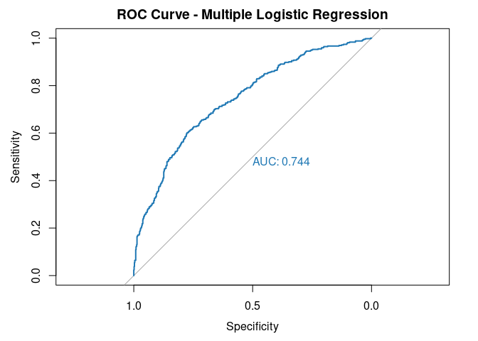

Task2
================

``` r
# --- Task 2 ---

# Load required library
library(pROC)
```

    ## Type 'citation("pROC")' for a citation.

    ## 
    ## Attaching package: 'pROC'

    ## The following objects are masked from 'package:stats':
    ## 
    ##     cov, smooth, var

``` r
# Example predictors to include (adjust if needed):
# Urin_ret, psa, age_pc_diag, albumin, lymphocyte, creatinine
# Ensure these variables exist in your 'merged_all' data frame.

model_multiple <- glm(
  metastasis ~ Urin_ret + psa + age_at_prostate_cancer_diagnosis + albumin + lymphocyte + creatinine,
  data = merged_all,
  family = "binomial"
)

summary(model_multiple)
```

    ## 
    ## Call:
    ## glm(formula = metastasis ~ Urin_ret + psa + age_at_prostate_cancer_diagnosis + 
    ##     albumin + lymphocyte + creatinine, family = "binomial", data = merged_all)
    ## 
    ## Coefficients:
    ##                                   Estimate Std. Error z value Pr(>|z|)    
    ## (Intercept)                      -7.580838   0.782646  -9.686  < 2e-16 ***
    ## Urin_ret                          1.002559   0.150634   6.656 2.82e-11 ***
    ## psa                               0.000652   0.000158   4.127 3.67e-05 ***
    ## age_at_prostate_cancer_diagnosis  0.076336   0.008799   8.676  < 2e-16 ***
    ## albumin                           0.022292   0.006214   3.587 0.000334 ***
    ## lymphocyte                        0.015576   0.004397   3.542 0.000397 ***
    ## creatinine                       -1.158552   0.490132  -2.364 0.018091 *  
    ## ---
    ## Signif. codes:  0 '***' 0.001 '**' 0.01 '*' 0.05 '.' 0.1 ' ' 1
    ## 
    ## (Dispersion parameter for binomial family taken to be 1)
    ## 
    ##     Null deviance: 1518.9  on 1158  degrees of freedom
    ## Residual deviance: 1306.6  on 1152  degrees of freedom
    ## AIC: 1320.6
    ## 
    ## Number of Fisher Scoring iterations: 6

``` r
# The exponentiated coefficients show the odds ratio
exp(coef(model_multiple))
```

    ##                      (Intercept)                         Urin_ret 
    ##                     0.0005101337                     2.7252460194 
    ##                              psa age_at_prostate_cancer_diagnosis 
    ##                     1.0006522526                     1.0793249863 
    ##                          albumin                       lymphocyte 
    ##                     1.0225422784                     1.0156978392 
    ##                       creatinine 
    ##                     0.3139405343

``` r
# Predict probabilities
merged_all$predicted_prob_mult <- predict(model_multiple, type = "response")

# Classify using a 0.5 threshold
merged_all$predicted_class_mult <- ifelse(merged_all$predicted_prob_mult >= 0.5, 1, 0)

# Create a confusion matrix
table(Predicted = merged_all$predicted_class_mult, Actual = merged_all$metastasis)
```

    ##          Actual
    ## Predicted   0   1
    ##         0 645 245
    ##         1  93 176

``` r
# Calculate performance metrics
TP <- sum(merged_all$predicted_class_mult == 1 & merged_all$metastasis == 1)
TN <- sum(merged_all$predicted_class_mult == 0 & merged_all$metastasis == 0)
FP <- sum(merged_all$predicted_class_mult == 1 & merged_all$metastasis == 0)
FN <- sum(merged_all$predicted_class_mult == 0 & merged_all$metastasis == 1)

accuracy_mult <- (TP + TN) / (TP + TN + FP + FN)
sensitivity_mult <- TP / (TP + FN)
specificity_mult <- TN / (TN + FP)

cat("Accuracy:", round(accuracy_mult, 3), "\n")
```

    ## Accuracy: 0.708

``` r
cat("Sensitivity:", round(sensitivity_mult, 3), "\n")
```

    ## Sensitivity: 0.418

``` r
cat("Specificity:", round(specificity_mult, 3), "\n")
```

    ## Specificity: 0.874

``` r
# ROC curve analysis
roc_mult <- roc(merged_all$metastasis, merged_all$predicted_prob_mult)
```

    ## Setting levels: control = 0, case = 1

    ## Setting direction: controls < cases

``` r
plot(roc_mult, main = "ROC Curve - Multiple Logistic Regression", col = "#1f78b4", print.auc = TRUE)
```

<!-- -->

``` r
saveRDS(model_multiple, 'model_multiple.rds')
```
