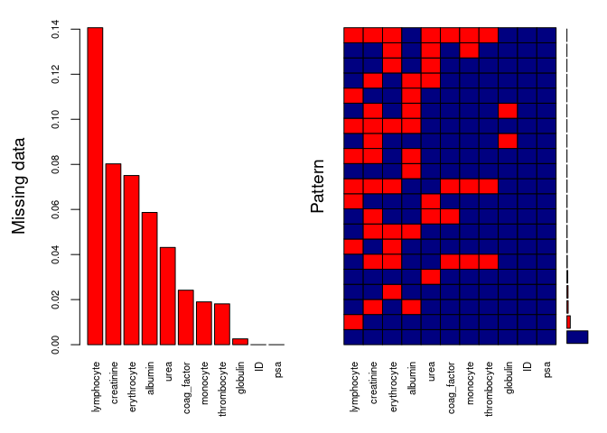
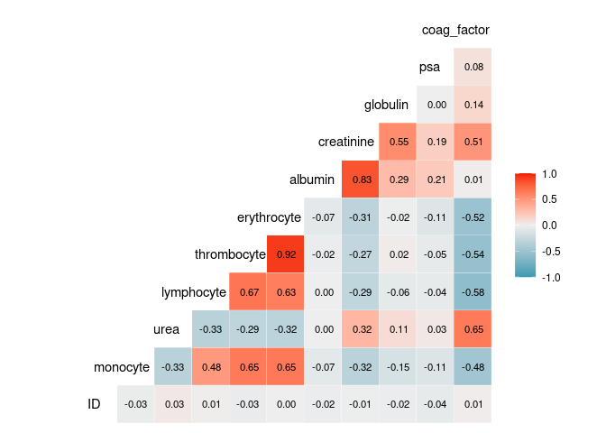

Task 2
================

``` r
DATASET2 <- read_csv("../../DATASET2.csv")
```

    ## Rows: 1159 Columns: 11
    ## ── Column specification ────────────────────────────────────────────────────────
    ## Delimiter: ","
    ## dbl (11): ID, monocyte, urea, lymphocyte, thrombocyte, erythrocyte, albumin,...
    ## 
    ## ℹ Use `spec()` to retrieve the full column specification for this data.
    ## ℹ Specify the column types or set `show_col_types = FALSE` to quiet this message.

``` r
#View(DATASET2)

# Check how many NA values exist per variable
DATASET2 %>% summarise_all(~sum(is.na(.)))
```

    ## # A tibble: 1 × 11
    ##      ID monocyte  urea lymphocyte thrombocyte erythrocyte albumin creatinine
    ##   <int>    <int> <int>      <int>       <int>       <int>   <int>      <int>
    ## 1     0       22    50        163          21          87      68         93
    ## # ℹ 3 more variables: globulin <int>, psa <int>, coag_factor <int>

``` r
install.packages("VIM")  # Only once
```

    ## Installing package into '/home/anton/R/x86_64-pc-linux-gnu-library/4.5'
    ## (as 'lib' is unspecified)
    ## also installing the dependencies 'Matrix', 'SparseM', 'MatrixModels', 'minqa', 'nloptr', 'pbkrtest', 'quantreg', 'lme4', 'lmtest', 'RcppEigen', 'car', 'robustbase', 'vcd', 'ranger'

``` r
#install.packages("DEoptimR")

library(VIM)
```

    ## Loading required package: colorspace
    ## Loading required package: grid
    ## VIM is ready to use.
    ## 
    ## Suggestions and bug-reports can be submitted at: https://github.com/statistikat/VIM/issues
    ## 
    ## Attaching package: 'VIM'
    ## 
    ## The following object is masked from 'package:datasets':
    ## 
    ##     sleep

``` r
# Visualize missing data as a bar and pattern
aggr(DATASET2, col = c("navyblue", "red"), numbers = TRUE, sortVars = TRUE,
     labels = names(DATASET2), cex.axis = .7, gap = 3, 
     ylab = c("Missing data", "Pattern"))
```

    ## Warning in plot.aggr(res, ...): not enough horizontal space to display
    ## frequencies

<!-- -->

    ## 
    ##  Variables sorted by number of missings: 
    ##     Variable       Count
    ##   lymphocyte 0.140638481
    ##   creatinine 0.080241588
    ##  erythrocyte 0.075064711
    ##      albumin 0.058671268
    ##         urea 0.043140638
    ##  coag_factor 0.024158758
    ##     monocyte 0.018981881
    ##  thrombocyte 0.018119068
    ##     globulin 0.002588438
    ##           ID 0.000000000
    ##          psa 0.000000000

``` r
# Check correlations between variables
install.packages("GGally")
```

    ## Installing package into '/home/anton/R/x86_64-pc-linux-gnu-library/4.5'
    ## (as 'lib' is unspecified)

``` r
library(GGally)
```

    ## Loading required package: ggplot2

``` r
# Correlation matrix (numerical vars only)
ggcorr(DATASET2, label = TRUE, label_round = 2, label_size = 3, 
       hjust = 0.75, layout.exp = 1)
```

<!-- -->
